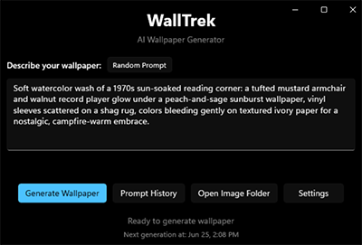

# WallTrek

WallTrek is a WinUI 3 application that generates AI-powered wallpapers using multiple AI providers (OpenAI DALL-E 3, Google Imagen). The application runs in the system tray and can automatically generate and set new wallpapers at specified intervals with customizable random prompt elements.

[Example Generated Wallpapers](https://www.deviantart.com/swaxtastic/gallery/all)



## Features

- **Multi-provider AI support** - Choose between OpenAI DALL-E 3 and Google Imagen for image generation
- **Flexible LLM integration** - Use OpenAI GPT models or Anthropic Claude for text generation and image descriptions
- **Customizable random prompts** - Configure random elements at the key level for varied prompt generation
- **Prompt history management** with search, favorites, usage tracking, and model metadata
- **DeviantArt integration** - upload and share generated wallpapers with auto-generated titles and tags, including "I'm feeling lucky" quick upload
- **System tray integration** with minimal UI footprint
- **Automatic wallpaper generation** with configurable intervals and source modes
- **Database persistence** for prompt and image history using SQLite with model tracking
- **Image management** - view, set as background, or delete generated images
- **Windows startup integration** - optional run on system startup
- **EXIF metadata preservation** with original prompts embedded in images
- **Multi-view interface** for generation, history, and settings management

## Why DeviantArt Integration?

DeviantArt was chosen as the sharing platform because it supports API uploads with tags and prompts, allows full-resolution downloads, offers strong search and community features, and clearly permits AI-generated art. This makes it an ideal platform for sharing and discovering AI-generated wallpapers within a supportive creative community.

## Requirements

- Windows 10/11
- .NET 9.0 Runtime
- At least one AI provider API key:
  - OpenAI API key (for DALL-E 3 and GPT models)
  - Google AI API key (for Imagen image generation)
  - Anthropic API key (for Claude models and image descriptions)
- DeviantArt API credentials (optional, for upload functionality)

## Installation

### Option 1: Download Pre-built Release (Recommended)

1. Download the latest release from [Releases](https://github.com/swax/WallTrek/releases)
2. Unzip the contents to your desired location
3. Run `WallTrek.exe`

### Option 2: Build from Source

1. Clone the repository
2. Restore NuGet packages: `dotnet restore`
3. Build the project: `dotnet build`
4. Run the project: `dotnet run`

**Note**: VS Code is supported, though for some XAML errors may need Visual Studio for more details.

### Configuration

1. **Initial Setup**: Right-click the system tray icon to open the application
2. **API Configuration**: Navigate to Settings → API tab and configure your preferred AI providers:
   - **OpenAI**: Enter API key and select GPT model for text generation
   - **Google AI**: Enter API key for Imagen image generation
   - **Anthropic**: Enter API key for Claude models and image descriptions
3. **Provider Selection**: Choose your preferred image generation and LLM services in the main interface
4. **DeviantArt Setup** (Optional): Configure DeviantArt Client ID and Secret for upload functionality
5. **Auto-Generation**: Configure generation interval and choose between:
   - **Current Prompt**: Use your saved prompt for auto-generation
   - **Random Prompts**: Generate new AI-created prompts automatically with customizable elements
6. **Startup Options**: Enable "Run on Windows startup" for automatic launching
7. **Prompt Management**: Use the Prompt History view to manage and favorite prompts with model metadata
8. **Image Sharing**: Right-click images in history to upload to DeviantArt with AI-generated titles and tags, or use "I'm feeling lucky" for quick uploads

### Generated Content

- **Image Storage**: Wallpapers saved to `%USERPROFILE%\Pictures\WallTrek\`
- **File Naming**: Includes timestamp and prompt in filename for easy identification
- **Metadata**: EXIF data contains original generation prompt for reference
- **Database Tracking**: All prompts and images tracked in local SQLite database
- **Auto-Wallpaper**: Desktop wallpaper automatically updated upon generation
- **History Access**: View, search, and manage all generated content through the UI

## Architecture

### User Interface

- **Views/MainView**: Primary wallpaper generation interface
- **Views/PromptHistoryView**: Search, browse, and manage prompt history with favorites
- **Views/SettingsView**: Tabbed settings interface with General, API, and Random Prompt configuration
- **System Tray**: Minimal footprint with quick access to all features

### Core Services

- **Services/ImageGenerator**: Multi-provider image generation with factory pattern support
- **Services/ImageGenerationServiceFactory**: Creates appropriate image generation service instances
- **Services/GoogleImagenService**: Google Imagen API integration for image generation
- **Services/LlmServiceFactory**: Creates appropriate LLM service instances
- **Services/OpenAILlmService**: OpenAI GPT API integration for text generation
- **Services/AnthropicLlmService**: Anthropic Claude API integration for text generation and image descriptions
- **Services/PromptGeneratorService**: AI-powered random prompt generation with customizable elements
- **Services/TitleService**: AI-powered title and tag generation for DeviantArt uploads
- **Services/DeviantArt**: OAuth authentication and upload functionality for DeviantArt integration
- **Services/DatabaseService**: SQLite persistence for prompt and image history with model metadata
- **Services/AutoGenerateService**: Configurable timer-based automatic generation
- **Services/StartupManager**: Windows registry integration for startup functionality
- **Services/Wallpaper**: Desktop wallpaper integration via Win32 API

### Data Storage

- **Settings**: `%APPDATA%\WallTrek\settings.json` - Application configuration
- **Database**: `%APPDATA%\WallTrek\walltrek.db` - Prompt and image history
- **Images**: `%USERPROFILE%\Pictures\WallTrek\` - Generated wallpaper files

### Technical Stack

- **.NET 9.0** with **WinUI 3** (Windows App SDK 1.7.250606001)
- **OpenAI API v2.1.0** for DALL-E 3 image generation and GPT text generation
- **Anthropic SDK** for Claude model text generation and image descriptions
- **Google Generative AI** for Imagen image generation
- **SQLite** via Microsoft.Data.Sqlite for data persistence
- **H.NotifyIcon.WinUI** for system tray functionality
- **System.Drawing.Common** for image processing and metadata

## Packaging

Build for distribution: Self-Contained (~80 MB includes .NET 9 and Windows App SDK)

```bash
dotnet publish -c Release -r win-x64
```

Output will be in `bin/Release/net9.0-windows10.0.19041.0/win-x64/publish/`

## License

This project is open source. MIT license.